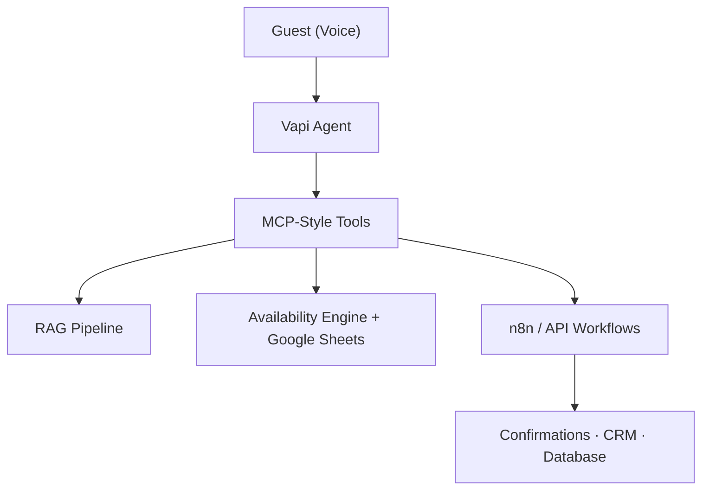

# Case Study: AI Voice Receptionist for Hotel Operations

> A production-style AI automation system for hotel front-desk operations — voice interaction, live inventory, document-driven knowledge, and workflow orchestration.

**Author role demonstrated:** AI Automation Engineer  
**Repository type:** Public portfolio — architecture and engineering showcase  
**Related:** [README](README.md) · [Architecture](docs/architecture.md)

---

## Executive Summary

Hotels depend on front-desk staff to answer repetitive, time-sensitive questions — room availability, policies, booking requests — often under pressure and outside normal business hours.

This project delivers an **AI voice receptionist** that handles those interactions through a **production-minded architecture**: a Vapi voice agent orchestrates backend tools for live inventory checks, RAG-based policy answers, and automated booking workflows connected via n8n and API integrations.

The result is not a demo chatbot. It is a **decoupled, integration-ready system** designed for operational accuracy, maintainability, and downstream automation — with proprietary implementation details intentionally protected.

---

## Business Problem

### Context

Hotel front desks are high-touch, high-volume environments. Guests expect immediate answers about availability, policies, and reservations. Staff time is limited, and errors — especially double-bookings or outdated policy information — directly impact guest satisfaction and revenue.

### Pain Points

| Pain point | Impact |
|------------|--------|
| Repetitive policy questions | Staff time diverted from complex guest needs |
| Stale availability information | Guest frustration, lost bookings, or double-booking risk |
| After-hours inquiry gaps | Missed opportunities when the desk is unmanned |
| Hard-coded chatbot responses | Expensive to maintain; break when policies or inventory change |
| Disconnected systems | Voice tools that cannot act on real inventory or trigger bookings |

### Goal

Automate routine front-desk voice interactions while maintaining **live data accuracy**, **maintainable knowledge**, and **reliable booking workflows** — without treating the LLM as the system of record.

---

## Solution

### Approach

Build a voice agent that **acts through tools**, not open-ended generation:

1. **Guest speaks** to a Vapi-powered voice agent
2. **Agent routes intent** via MCP-style tool calls
3. **Backend systems respond** with structured operational data
4. **Agent speaks results** naturally to the guest
5. **Workflows execute** downstream actions on confirmation

### Core capabilities delivered

- Voice-based guest interaction for availability and policy inquiries
- Real-time room availability validation against live inventory
- Document-driven policy answers via RAG — no model retraining required
- Reservation workflow automation with downstream CRM and confirmation support
- Clear separation between conversation and operational backend

---

## System Architecture

### Layer responsibilities

| Layer | Responsibility |
|-------|----------------|
| Voice (Vapi) | Natural dialogue, intent detection, tool invocation |
| Orchestration | Structured tool routing with defined contracts |
| Availability | Date validation, conflict checks, inventory reads/writes |
| Knowledge (RAG) | Policy retrieval from maintained documents |
| Automation (n8n) | Multi-step booking and integration workflows |

Full technical documentation: [docs/architecture.md](docs/architecture.md)

---

## Technical Decisions

### 1. Tool orchestration over end-to-end LLM

**Decision:** Operational actions (availability, booking) are handled by backend tools, not generated by the language model.

**Why:** LLMs are strong at conversation but unreliable as systems of record. Tool contracts enforce structured inputs, validated outputs, and testable business logic.

---

### 2. MCP-style tool pattern

**Decision:** Adopt an MCP-style separation between the voice agent and backend capabilities.

**Why:** Industry-aligned pattern for agent systems. Enables independent versioning, backend swaps, and clear debugging boundaries.

---

### 3. Google Sheets as operational data layer

**Decision:** Use Google Sheets for inventory and reservation data in the demonstration environment.

**Why:** Rapid to build and inspect; familiar to operations teams; sufficient for portfolio demonstration. The architecture supports migration to a PMS or database without redesigning the voice layer.

---

### 4. RAG for policy knowledge

**Decision:** Policy and FAQ answers retrieved from indexed documents, not hard-coded prompts.

**Why:** Operations teams update documents — not code. Policy changes propagate through the indexing pipeline without redeployment or model retraining.

---

### 5. n8n for workflow automation

**Decision:** Multi-step booking and integration flows handled by n8n with API connections.

**Why:** Visual workflow design, strong integration ecosystem, and clear separation of automation logic from the voice layer.

---

### 6. Portfolio-only public repository

**Decision:** Publish architecture, case study, and sanitized diagrams. Keep production workflows, prompts, and credentials private.

**Why:** Demonstrates engineering depth to recruiters and clients without exposing proprietary assets or creating security risk.

---

## Challenges Solved

### Stale inventory responses

**Challenge:** Static or cached availability data leads to incorrect guest answers and booking conflicts.

**Solution:** Availability engine reads live inventory and validates against confirmed and pending reservations before every response and again before booking write.

---

### Conversational AI coupled to backend logic

**Challenge:** Monolithic agent designs make debugging, testing, and backend changes difficult.

**Solution:** MCP-style tool orchestration decouples voice interaction from operational actions. Each tool has a defined contract and independent backend.

---

### Knowledge maintenance burden

**Challenge:** Hard-coded prompts and FAQ lists require developer intervention for every policy change.

**Solution:** RAG pipeline over maintained documents. Update the document → re-index → agent answers reflect current policy.

---

### Downstream integration gaps

**Challenge:** Voice systems that stop at conversation without triggering real operational workflows.

**Solution:** n8n and API integrations handle reservation recording, confirmations, CRM updates, and notifications as structured workflow side effects.

---

### Reliability in production contexts

**Challenge:** Agent systems that work in demos but fail under real operational edge cases.

**Solution:** Structured tool outputs, availability re-validation at booking time, idempotent workflow design, and clear component boundaries.

---

## Trade-offs

| Choice | Benefit | Cost |
|--------|---------|------|
| Google Sheets over dedicated DB | Fast iteration, easy inspection | Not ideal at very high transaction volume |
| RAG over fine-tuning | Maintainable, no retraining | Requires document quality and indexing hygiene |
| n8n over custom microservices | Rapid workflow development | Self-hosted ops or platform costs at scale |
| Tool orchestration over simple chatbot | Operational accuracy | Higher initial architecture complexity |
| Portfolio repo over open-source release | Protects proprietary assets | Reviewers cannot inspect live implementation |

These trade-offs reflect **pragmatic production thinking** — optimize for maintainability and accuracy first, with clear scale paths documented.

---

## Lessons Learned

1. **The LLM is the interface, not the database.** Operational truth lives in tools and connected systems.
2. **Tool contracts are architecture.** Defining clear tool boundaries early prevents fragile agent behavior later.
3. **RAG pays off when policies change.** Document-driven knowledge matches how operations teams actually work.
4. **Re-validate before write.** Availability can change between inquiry and confirmation — always check again.
5. **Portfolio repos need explicit boundaries.** Stating what is excluded builds trust with technical reviewers.
6. **Diagrams communicate faster than prose.** Recruiters and clients evaluate system thinking from architecture visuals first.

---

## Future Improvements

| Area | Enhancement |
|------|-------------|
| **Data layer** | Migrate inventory to PMS API or dedicated database |
| **Multi-property** | Per-property tool routing and knowledge base partitioning |
| **Observability** | Structured logging, tool-call tracing, workflow monitoring dashboards |
| **Human handoff** | Escalation path to live staff for complex or high-value inquiries |
| **Language support** | Multi-language voice and knowledge base coverage |
| **Demo assets** | End-to-end video walkthrough and sanitized screenshots (see [demo checklist](docs/demo-checklist.md)) |

---

## Skills Demonstrated

| Skill | Evidence in this project |
|-------|--------------------------|
| AI Agent Development | Vapi voice agent with structured tool invocation |
| Voice AI Systems | Natural guest interaction design |
| Workflow Automation | n8n multi-step booking and integration flows |
| System Design | Layered architecture with clear component boundaries |
| API Integrations | CRM, confirmation, and database connectivity |
| RAG Pipelines | Document-driven policy retrieval |
| Data Orchestration | Live inventory reads, writes, and validation |
| Production Architecture | Reliability patterns, security boundaries, portfolio discipline |

---

## Repository Notice

This case study describes architecture and engineering decisions. It does not include:

- Production n8n workflow exports
- API keys, credentials, or webhook URLs
- Proprietary prompts or tuning details
- Customer or operational data
- Full proprietary business logic

For technical depth, see [docs/architecture.md](docs/architecture.md).  
For demo asset planning, see [docs/demo-checklist.md](docs/demo-checklist.md).

---

*Portfolio case study — shared for recruiter, client, and employer evaluation.*
