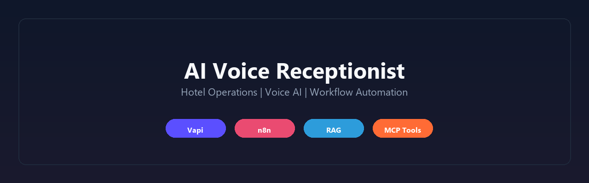
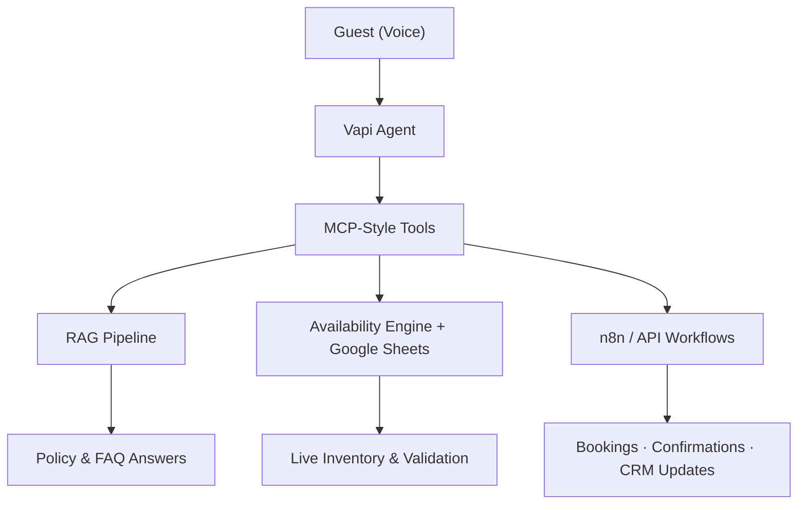

# AI Voice Receptionist for Hotel Operations

> Production-style front-desk automation — AI voice agent, live inventory, RAG policy answers, and MCP-style workflow orchestration.

---

## At a Glance

| | |
|---|---|
| **Built by** | AI Automation Engineer |
| **Domain** | Hospitality — hotel front-desk operations |
| **Pattern** | Voice → tool orchestration → live data + knowledge → downstream automation |
| **Repository type** | **Public portfolio** — architecture & engineering showcase, not a source-code release |

**In one sentence:** An AI voice receptionist that answers guest questions, checks live room availability, and triggers reservation workflows through connected systems — designed with production reliability, maintainability, and integration depth in mind.

---

## Problem Statement

Hotel front desks handle high-volume, time-sensitive work: policy questions, availability checks, and booking actions that must stay accurate as inventory changes.

Most automation approaches fall short — static chatbots deliver stale answers, hard-coded responses require redeployment when policies change, and disconnected systems create double-booking risk.

This project demonstrates a **production-minded alternative**: a voice agent backed by live operational data, document-driven knowledge retrieval, and structured workflow automation.

---

## Architecture Overview

The system separates **conversational interaction** from **operational backend actions**. The voice agent handles natural dialogue; MCP-style tool calls route work to the right backend systems.

| Component | Role |
|-----------|------|
| **Vapi Agent** | Natural voice interface for guest inquiries |
| **MCP-Style Tools** | Structured bridge between conversation and backend systems |
| **RAG Pipeline** | Document-based policy and FAQ retrieval |
| **Availability Engine** | Real-time room checks with date and conflict validation |
| **Google Sheets** | Operational inventory and reservation data layer |
| **n8n / API Workflows** | Booking recording, confirmations, and downstream integrations |

Full architecture documentation: **[docs/architecture.md](docs/architecture.md)** · Case study: **[CASE_STUDY.md](CASE_STUDY.md)**

---

## Demo

> Visual assets are in progress. Placeholders below will be replaced with sanitized portfolio media.

| Asset | Status |
|-------|--------|
| **Demo video** | Coming Soon — end-to-end voice interaction walkthrough |
| **Screenshots** | Coming Soon — architecture views, workflow overview, inventory interface |
| **Workflow GIF** | Coming Soon — guest inquiry → availability check → booking flow |

Asset checklist: **[docs/demo-checklist.md](docs/demo-checklist.md)**

---

## Engineering Skills Demonstrated

- **AI Agent Development** — conversational agent design with structured tool invocation
- **Voice AI Systems** — natural guest interaction via Vapi
- **Workflow Automation** — multi-step booking and follow-up flows via n8n
- **System Design** — decoupled architecture separating voice, data, knowledge, and automation layers
- **API Integrations** — connectivity to operational systems, CRM, and downstream services
- **RAG Pipelines** — document-driven knowledge retrieval without model retraining
- **Data Orchestration** — live inventory reads, writes, and validation across connected data sources
- **Production Architecture** — reliability-focused design with structured outputs and integration-ready workflows

---

## Key Capabilities

| Capability | How It's Handled |
|------------|------------------|
| Voice guest interaction | Vapi voice agent |
| Live room availability | Availability engine + Google Sheets inventory |
| Policy & FAQ answers | RAG pipeline over maintainable documents |
| Reservation workflows | Tool-triggered validation, recording, and follow-up |
| Downstream automation | n8n workflows and API integrations |

---

## Challenges Solved

| Challenge | Approach |
|-----------|----------|
| **Preventing stale inventory responses** | Real-time availability engine validates against live Sheets data and existing reservations before responding |
| **Separating conversational AI from backend actions** | MCP-style tool orchestration — the voice layer handles dialogue; tools handle operational logic |
| **Maintaining knowledge without retraining** | RAG pipeline retrieves answers from updated documents — no prompt rewrites or model retraining required |
| **Supporting downstream integrations** | Structured workflow outputs trigger confirmations, CRM updates, and database actions via n8n and APIs |
| **Designing for reliability and maintainability** | Clear component boundaries, structured tool responses, and document-driven knowledge reduce fragility over time |

---

## Why This Project Matters

This is not a simple chatbot demo. It reflects how AI automation is built for **real operational environments**:

- **Live data dependency** — availability answers are grounded in current inventory, not static training data
- **Tool orchestration** — the agent acts through defined backend capabilities, not open-ended generation
- **Maintainable knowledge** — business policies update through documents, matching how operations teams actually work
- **Integration depth** — booking flows connect to downstream systems, not isolated conversation endpoints
- **Production boundaries** — architecture and decisions are documented; proprietary implementation stays protected

For recruiters, clients, and hiring managers, this project signals the ability to design **end-to-end AI systems** — not just prompt engineering.

---

## Business Value

- **Extended front-desk coverage** — routine inquiries handled outside staffed hours
- **Reduced staff load** — automation absorbs repetitive availability and policy questions
- **Lower double-booking risk** — live validation against inventory and pending reservations
- **Faster guest response** — immediate voice answers instead of hold queues or callbacks
- **Maintainable operations** — policy and FAQ updates via documents without code changes
- **Integration-ready outputs** — structured workflow results support CRM, email, and database actions

---

## Technology Stack

| Layer | Technologies |
|-------|--------------|
| **Voice interface** | Vapi |
| **Tool orchestration** | MCP-style tool calls |
| **Workflow automation** | n8n |
| **Operational data** | Google Sheets |
| **Knowledge retrieval** | RAG pipeline, vector database pattern |
| **Integrations** | API connections (CRM, confirmations, database) |
| **Backend logic** | Availability validation, booking workflow rules |

---

## Documentation

| Document | Description |
|----------|-------------|
| [CASE_STUDY.md](CASE_STUDY.md) | Full project narrative for recruiters and clients |
| [docs/architecture.md](docs/architecture.md) | System design, components, and detailed diagrams |
| [docs/demo-checklist.md](docs/demo-checklist.md) | Screenshot and demo asset checklist |
| [assets/](assets/) | Banners, badges, and profile visual assets |

---

## Skills Signal

`AI Agents` · `Voice AI` · `Vapi` · `n8n` · `RAG` · `MCP-Style Orchestration` · `Workflow Automation` · `API Integrations` · `Google Sheets` · `System Design` · `Production Architecture` · `Hospitality Operations`

---

## Repository Notice

**This is a public portfolio repository, not a source-code release.**

It exists to demonstrate **architecture, engineering decisions, and production thinking**.

This repository intentionally excludes:

- Production n8n workflow exports
- API keys and credentials
- Proprietary prompts and tuning details
- Proprietary business logic
- Customer or operational data

Sanitized diagrams, case studies, and documentation are shared so recruiters, clients, and employers can evaluate system design — without exposing production assets.

---

## Contact

<!-- Replace placeholders before publishing -->

| | |
|---|---|
| **LinkedIn** | `https://www.linkedin.com/in/maria-bano-ai/` |
| **Portfolio / Website** | `` |
| **Email** | `mariabano.official@gmail.com` |
| **Demo video** | Coming Soon |

---

## License & Usage

Documentation and diagrams are shared for portfolio and evaluation purposes. Production implementation details remain private.
