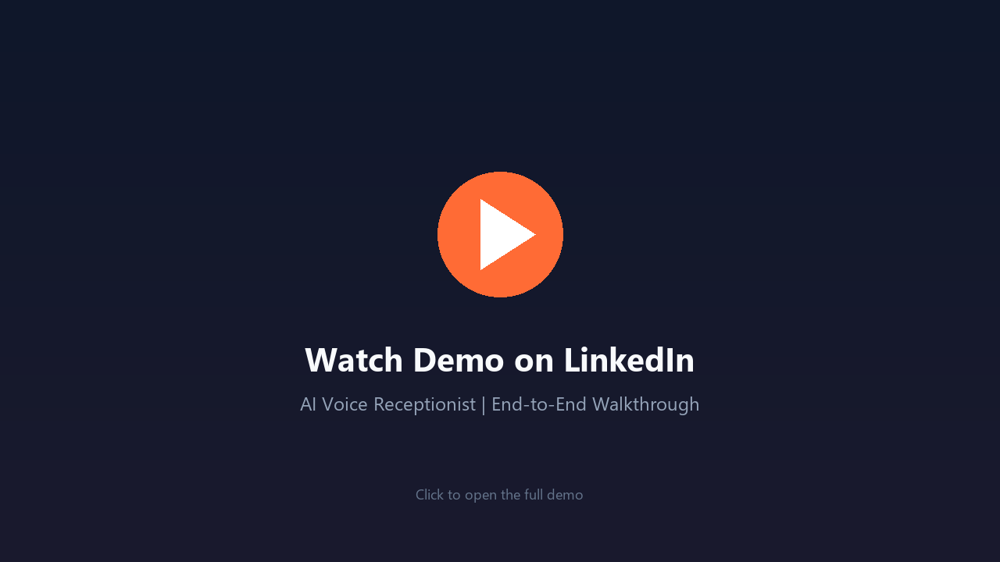
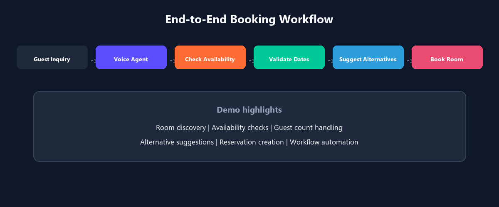
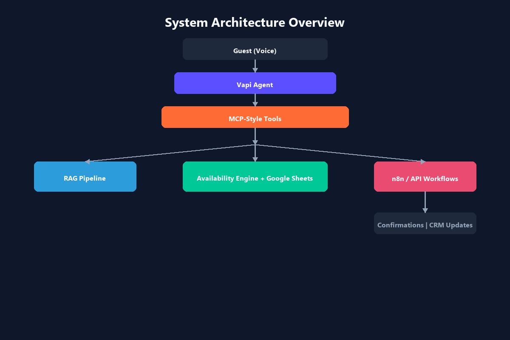
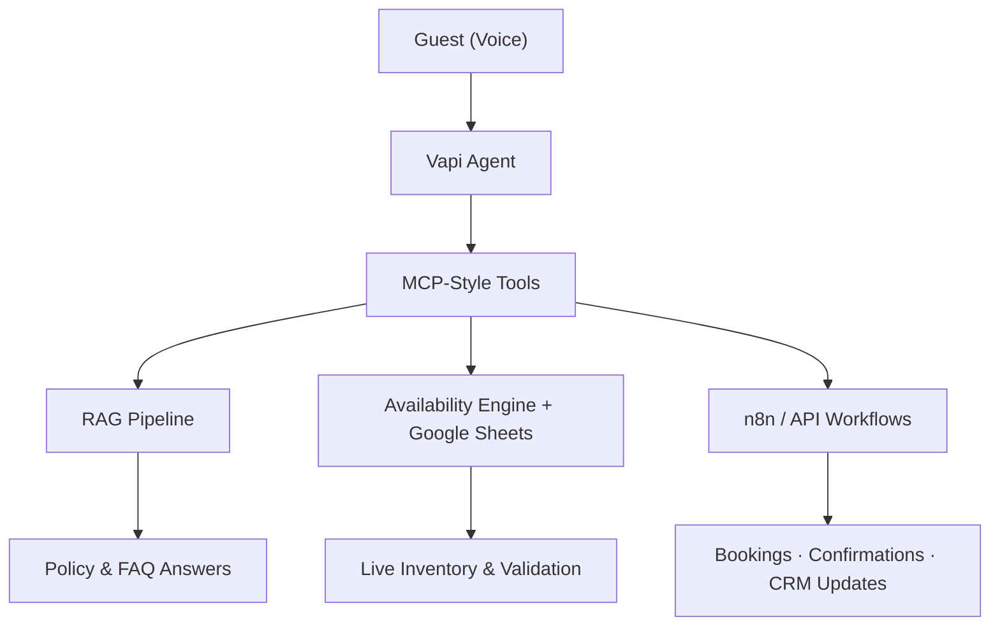

# AI Voice Receptionist for Hotel Operations

> Production-style front-desk automation — AI voice agent, live inventory, RAG policy answers, and MCP-style workflow orchestration.

---

## At a Glance

| | |
|---|---|
| **Built by** | Maria Bano — AI Automation Engineer |
| **Domain** | Hospitality — hotel front-desk operations |
| **Pattern** | Voice → tool orchestration → live data + knowledge → downstream automation |
| **Repository type** | Public portfolio — architecture showcase, not a source-code release |

**One line:** An AI voice receptionist that checks live room availability, answers policy questions, and triggers reservation workflows — built for production reliability and maintainability.

---

## Demo

**Watch the full demo on LinkedIn:**  
https://www.linkedin.com/feed/update/urn:li:activity:7476686387690455043/

**Download the demo video:** [demo/AI-Voice-Receptionist-Demo.mp4](demo/AI-Voice-Receptionist-Demo.mp4)

**The demo showcases:**

- Room discovery
- Availability checks
- Guest count handling
- Alternative room suggestions
- Reservation creation
- End-to-end workflow automation

---

## Problem Statement

Hotel front desks handle high-volume, time-sensitive work — policy questions, availability checks, and booking actions that must stay accurate as inventory changes.

Static chatbots deliver stale answers. Hard-coded responses require redeployment when policies change. Disconnected systems create double-booking risk.

This project demonstrates a **production-minded alternative**: a voice agent backed by live operational data, document-driven knowledge retrieval, and structured workflow automation.

---

## Architecture Overview

The system separates **conversational interaction** from **operational backend actions**.

| Component | Role |
|-----------|------|
| **Vapi Agent** | Natural voice interface for guest inquiries |
| **MCP-Style Tools** | Structured bridge between conversation and backend systems |
| **RAG Pipeline** | Document-based policy and FAQ retrieval |
| **Availability Engine** | Real-time room checks with date and conflict validation |
| **Google Sheets** | Operational inventory and reservation data layer |
| **n8n / API Workflows** | Booking recording, confirmations, and downstream integrations |

**Deep dive:** [docs/architecture.md](docs/architecture.md) · [CASE_STUDY.md](CASE_STUDY.md)

---

## Skills Demonstrated

| Skill | Evidence |
|-------|----------|
| AI Agent Development | Vapi voice agent with structured tool invocation |
| Voice AI Systems | Natural guest interaction for availability and booking |
| Workflow Automation | n8n multi-step booking and integration flows |
| System Design | Decoupled voice, data, knowledge, and automation layers |
| API Integrations | CRM, confirmation, and database connectivity |
| RAG Pipelines | Document-driven policy retrieval without retraining |
| Data Orchestration | Live inventory reads, writes, and validation |
| Production Architecture | Reliability patterns, security boundaries, portfolio discipline |

---

## Key Engineering Decisions

- **Tool orchestration over end-to-end LLM** — operational truth lives in backend systems, not generated text
- **MCP-style tool contracts** — clear agent-to-backend boundary with structured I/O
- **Live inventory validation** — availability checked against current data and pending reservations
- **RAG for policies** — document updates propagate without redeployment or model retraining
- **Re-validate before booking write** — conflict check at confirmation time, not just inquiry
- **Portfolio-only public repo** — architecture shared; proprietary workflows and prompts protected

See [examples/tool-contract-example.md](examples/tool-contract-example.md) for fictional tool contract illustrations.

---

## Why This Project Matters

This is not a simple chatbot demo. It reflects how AI automation is built for **real operational environments**:

- **Live data dependency** — availability answers grounded in current inventory
- **Tool orchestration** — the agent acts through defined backend capabilities
- **Maintainable knowledge** — business policies update through documents
- **Integration depth** — booking flows connect to downstream systems
- **Production boundaries** — architecture documented publicly; implementation stays private

**Interview prep:** [docs/interview-talking-points.md](docs/interview-talking-points.md)

---

## Business Value

- Extended front-desk coverage outside staffed hours
- Reduced staff load on repetitive availability and policy questions
- Lower double-booking risk via live inventory validation
- Faster guest response through immediate voice answers
- Maintainable operations — policy updates via documents, not code changes
- Integration-ready outputs for CRM, email, and database actions

---

## Technology Stack

| Layer | Technologies |
|-------|--------------|
| Voice interface | Vapi |
| Tool orchestration | MCP-style tool calls |
| Workflow automation | n8n |
| Operational data | Google Sheets |
| Knowledge retrieval | RAG pipeline, vector database pattern |
| Integrations | API connections (CRM, confirmations, database) |
| Backend logic | Availability validation, booking workflow rules |

---

## Documentation

| Document | Description |
|----------|-------------|
| [CASE_STUDY.md](CASE_STUDY.md) | Full project narrative for recruiters and clients |
| [docs/architecture.md](docs/architecture.md) | System design, components, and detailed diagrams |
| [docs/interview-talking-points.md](docs/interview-talking-points.md) | 2-min, 5-min, and technical interview scripts |
| [docs/github-profile-setup.md](docs/github-profile-setup.md) | Pin repo, topics, LinkedIn post, profile bio |
| [docs/demo-checklist.md](docs/demo-checklist.md) | Screenshot and demo asset checklist |
| [examples/tool-contract-example.md](examples/tool-contract-example.md) | Fictional MCP-style tool contracts |
| [assets/](assets/) | Banners, diagrams, and profile visual assets |
| [demo/](demo/) | Demo video archive and hosting notes |

---

## Skills Signal

`AI Agents` · `Voice AI` · `Vapi` · `n8n` · `RAG` · `MCP-Style Orchestration` · `Workflow Automation` · `API Integrations` · `Google Sheets` · `System Design` · `Production Architecture` · `Hospitality Operations`

---

## Repository Notice

**This is a public portfolio repository, not a source-code release.**

It demonstrates **architecture, engineering decisions, and production thinking**.

This repository intentionally excludes:

- Production n8n workflow exports
- API keys and credentials
- Webhook URLs
- Proprietary prompts and tuning details
- Proprietary business logic
- Customer or operational data

---

## Contact

| | |
|---|---|
| **LinkedIn** | [linkedin.com/in/maria-bano-ai](https://www.linkedin.com/in/maria-bano-ai/) |
| **Email** | mariabano.official@gmail.com |
| **Demo (LinkedIn)** | [Watch on LinkedIn](https://www.linkedin.com/feed/update/urn:li:activity:7476686387690455043/) |
| **Demo (download)** | [demo/AI-Voice-Receptionist-Demo.mp4](demo/AI-Voice-Receptionist-Demo.mp4) |

---

## License & Usage

Documentation and diagrams are licensed under [CC BY 4.0](LICENSE). Production implementation details remain private.
