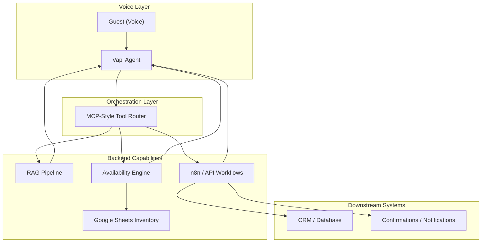
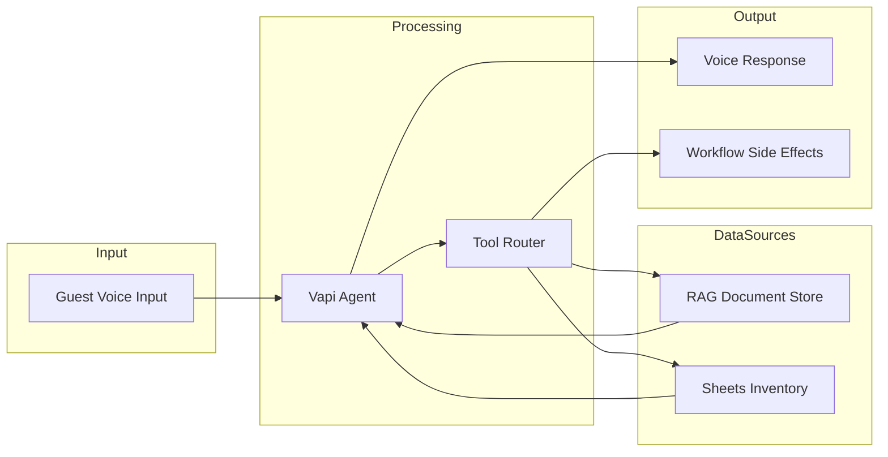
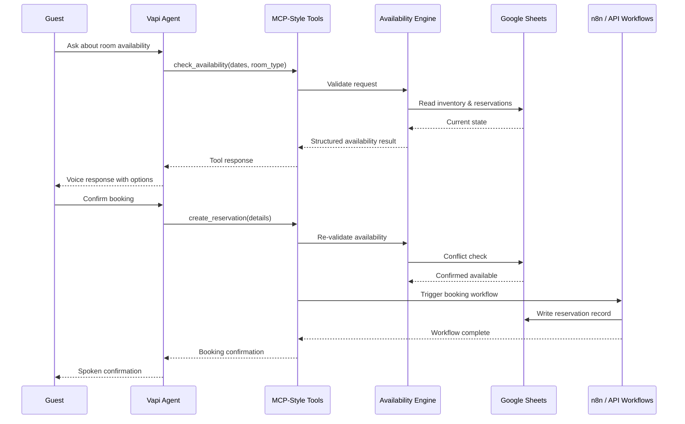
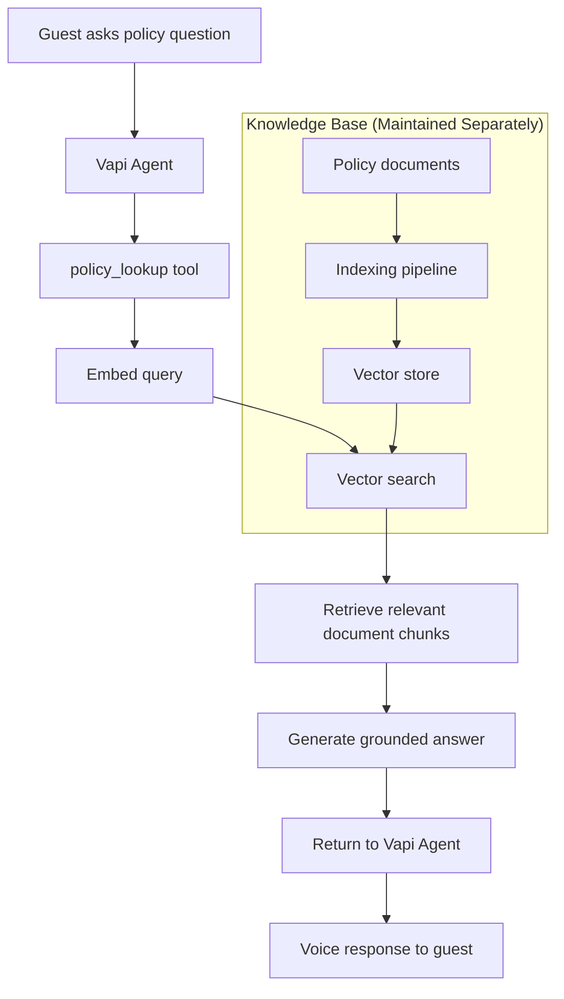
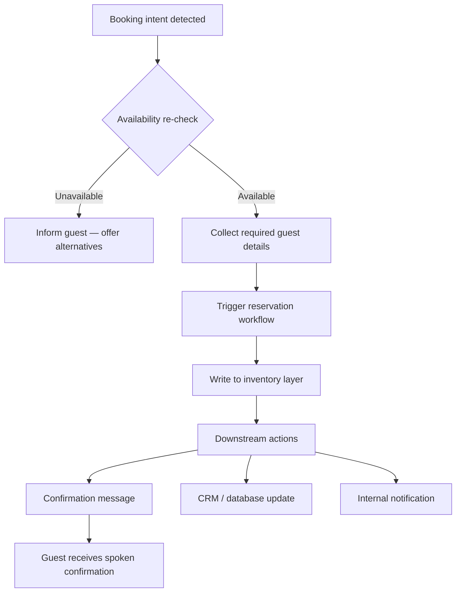

# System Architecture

> Sanitized architecture documentation for the AI Voice Receptionist portfolio project.  
> This document describes design patterns and component boundaries — not proprietary implementation details.

**Related:** [README](../README.md) · [CASE_STUDY.md](../CASE_STUDY.md) · [Demo Checklist](demo-checklist.md)

---

## System Overview

The AI Voice Receptionist is a **production-style front-desk automation system** for hotel operations. It enables guests to interact via voice while backend systems handle inventory validation, policy retrieval, and booking workflows.

The architecture follows a **layered, tool-driven pattern**:

1. **Voice layer** — natural guest conversation (Vapi)
2. **Orchestration layer** — MCP-style tool calls route intent to backend capabilities
3. **Data layer** — live inventory and reservation state (Google Sheets)
4. **Knowledge layer** — document-based policy answers (RAG)
5. **Automation layer** — booking recording and downstream actions (n8n, APIs)

This separation keeps conversational AI decoupled from operational logic — a core design principle for reliability and maintainability.

---

## High-Level Architecture

---

## Components

### 1. Vapi Voice Agent

**Role:** Primary guest-facing interface.

- Handles natural language voice interaction
- Manages conversation flow and turn-taking
- Invokes backend tools when operational data or actions are required
- Returns structured tool results as conversational responses

**Design note:** The agent does not directly access inventory or policy data. All operational actions flow through defined tools.

---

### 2. MCP-Style Tool Orchestration

**Role:** Bridge between conversation and backend systems.

- Exposes discrete, purpose-built tools (availability check, policy lookup, booking action)
- Enforces structured inputs and outputs
- Keeps backend logic versionable and testable independently of the voice layer

**Why MCP-style:** Tool orchestration is an industry pattern for agent systems. It prevents the voice model from hallucinating operational state and provides a clear contract between layers.

---

### 3. Availability Engine

**Role:** Real-time room availability validation.

- Reads current inventory from Google Sheets
- Validates guest-requested dates
- Checks for existing confirmed and pending reservations
- Returns structured availability results to the voice agent

**Design note:** Availability logic lives outside the LLM. The agent presents results; it does not compute them.

---

### 4. Google Sheets Inventory Layer

**Role:** Operational data store for room inventory and reservations.

- Serves as the system of record for portfolio demonstration purposes
- Supports read and write operations through connected workflows
- Enables rapid iteration without dedicated database infrastructure for the demo environment

**Production consideration:** In a full production deployment, Sheets may be replaced or synced with a PMS, CRM, or dedicated database. The tool-orchestration pattern remains the same.

---

### 5. RAG Knowledge Pipeline

**Role:** Document-driven policy and FAQ retrieval.

- Indexes hotel policy documents into a vector store
- Retrieves relevant context at query time
- Generates answers grounded in retrieved content

**Design note:** Policy updates require document changes only — no prompt rewrites or model retraining.

---

### 6. n8n / API Workflow Automation

**Role:** Multi-step operational workflows and integrations.

- Records confirmed reservations
- Triggers confirmation and notification flows
- Connects to downstream CRM and database systems via APIs

**Portfolio note:** Workflow structure is documented here. Production workflow exports are intentionally excluded from this repository.

---

## Design Decisions

| Decision | Rationale |
|----------|-----------|
| **Voice agent + tools, not end-to-end LLM** | Operational accuracy requires structured backend logic, not generated answers |
| **MCP-style tool contracts** | Clear boundaries, testable components, swappable backends |
| **Google Sheets for inventory** | Fast to demonstrate; familiar to operations teams; easy to inspect |
| **RAG for policies** | Documents are the source of truth; updates don't require redeployment |
| **n8n for automation** | Visual workflow orchestration with strong API integration support |
| **Portfolio-only public repo** | Architecture and decisions are shareable; proprietary assets stay private |

---

## Data Flow

### Conceptual Data Flow

### Data Types (Sanitized)

| Data | Direction | Handler |
|------|-----------|---------|
| Guest voice audio | Inbound | Vapi |
| Structured tool requests | Internal | Tool orchestration |
| Inventory rows | Read / Write | Availability engine, workflows |
| Policy document chunks | Read | RAG pipeline |
| Reservation records | Write | n8n / API workflows |
| Confirmation triggers | Outbound | n8n / API integrations |

No credentials, webhook URLs, or proprietary schemas are documented in this repository.

---

## Guest Booking Sequence

---

## RAG Workflow

**Maintenance flow:** Operations teams update source documents → indexing pipeline refreshes the vector store → agent answers reflect current policy without code changes.

---

## Reservation Workflow

---

## Scalability Considerations

| Area | Current approach | Scale path |
|------|------------------|------------|
| **Voice concurrency** | Vapi platform handles scaling | Platform-managed; monitor usage tiers |
| **Inventory data** | Google Sheets | Migrate to PMS API or dedicated database at volume |
| **RAG retrieval** | Vector store pattern | Shard by property; cache frequent policy queries |
| **Workflow execution** | n8n instance | Horizontal scaling or managed workflow service |
| **Multi-property** | Single-property demo | Per-property tool routing and knowledge bases |

The tool-orchestration boundary makes backend swaps possible without redesigning the voice layer.

---

## Security Considerations

| Concern | Mitigation |
|---------|------------|
| **Credential exposure** | Secrets stored in environment configuration — never in repository |
| **API access** | Scoped credentials with least-privilege access per integration |
| **Guest data** | Minimal PII collected; handled per data retention policy |
| **Webhook endpoints** | Authenticated and not published in portfolio materials |
| **Proprietary assets** | Prompts, workflow exports, and business logic kept private |
| **Sheets access** | Service account with read/write scoped to required ranges only |

See [SECURITY.md](../SECURITY.md) for the responsible disclosure process.

---

## Production Considerations

### Reliability

- **Structured tool outputs** — predictable responses for downstream parsing
- **Availability re-validation** — conflict check immediately before booking write
- **Idempotent workflow design** — safe retries on transient failures where applicable

### Maintainability

- **Document-driven knowledge** — policy updates without redeployment
- **Decoupled layers** — voice, data, knowledge, and automation evolve independently
- **Sanitized public documentation** — architecture shareable without exposing internals

### Observability (Recommended)

- Conversation and tool-call logging (sanitized for portfolio demos)
- Workflow execution monitoring in n8n
- Inventory write audit trail in Sheets or successor system

### What This Repository Does Not Include

- Production n8n workflow JSON exports
- API keys, credentials, or webhook URLs
- Proprietary prompts or tuning parameters
- Customer or operational data
- Full proprietary business logic

---

## Diagram Index

| Diagram | Location in this document |
|---------|---------------------------|
| High-level architecture | [High-Level Architecture](#high-level-architecture) |
| Guest booking sequence | [Guest Booking Sequence](#guest-booking-sequence) |
| RAG workflow | [RAG Workflow](#rag-workflow) |
| Reservation workflow | [Reservation Workflow](#reservation-workflow) |
| Data flow | [Data Flow](#data-flow) |

---

*Last updated: portfolio documentation release.*
